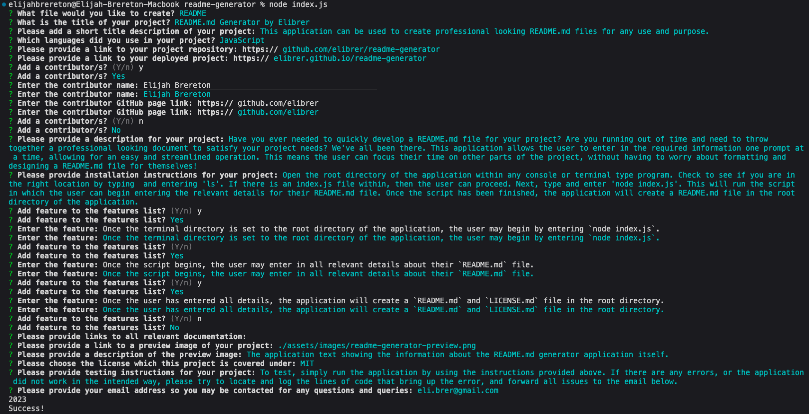

## README.md Generator by Elibrer 


---


*This application can be used to create professional looking README.md files for any use and purpose.*

## Languages used
 
## Links
> - [GitHub Repository](https://github.com/elibrer/readme-generator)
> 
> - [Deployed Application](https://elibrer.github.io/readme-generator)

## Contributors
> Elijah Brereton @[GitHub](https://github.com/elibrer)
 > 


## Table of Contents
- [Description](#description)
- [Installation](#installation)
- [Features](#features)
- [Documentation](#documentation)
- [Application Preview](#full-preview)
- [License](#license)
- [Tests](#tests)
- [Questions](#questions)

## Description
Have you ever needed to quickly develop a README.md file for your project? Are you running out of time and need to throw together a professional looking document to satisfy your project needs? We've all been there. This application allows the user to enter in the required information one prompt at a time, allowing for an easy and streamlined operation. This means the user can focus their time on other parts of the project, without having to worry about formatting and designing a README.md file for themselves!

## Installation
Ensure node.js has been installed on your system. For instructions on how to do this please visit: [nodejs.org](https://nodejs.org/en). 
Once node.js has been installed the user can open the root directory of this application within any console or terminal type program. Check to see if you are in the right location by typing  and entering 
```
ls
```
If the root directory is named `readme-generator` and there is an `index.js` file within, the user can then proceed. Next, type and enter 
```
node index.js
```
into the console. This will run the script in which the user can begin entering the relevant details for their README.md file. Once the script has been finished, the application will create a README.md file in the `./generated-files/` directory within the application.

## Features
- Once the terminal directory is set to the root directory of the application, the user may begin by entering 
```
node index.js
```
- Once the script begins, the user may choose between creating a `README.md` file or an `index.html` file with a blank preset.
- If the user selects the `index.html` file, a blank HTML file will be created within the `./generated-files/` directory. 
- If the user selects the `README.md` option, the prompts regarding the key information within their `README.md` file will begin. They may then enter in all relevant details about their `README.md` file.
- Some of the prompt input types are *`recursive`*, which draws from an extra *`inquirer`* command line interface called *`inquirer-recursive`*. This allows questions to be looped until the user is satisfied that all list items or groups of data are entered for a single question.
- Once the user has entered all details, the application will create a `README.md` and relevant `LICENSE.md` file based on their selection in the `./generated-files/` directory.
- These files can then be copied over into the users own project.

## Documentation
No documentation provided.

## Application Preview


## License
[Licensed under the MIT license.](https://opensource.org/licenses/MIT)

## Tests
To test, simply run the application by using the instructions provided above. If there are any errors, or the application did not work in the intended way, please try to locate and log the lines of code that bring up the error, and forward all issues to the email below.

## Questions
For questions and enquiries, please contact me at: 
[eli.brer@gmail.com](eli.brer@gmail.com)
